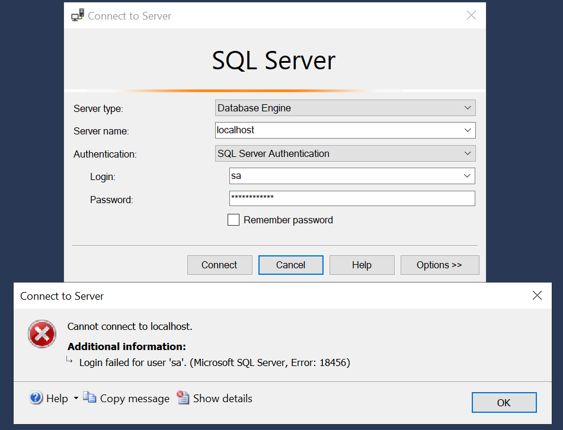

## Use the pre-built image for this solution

1. Pull the latest [consumerdataright/authorisation-server](https://hub.docker.com/r/consumerdataright/authorisation-server) image from Docker Hub.
   ```shell
   docker pull consumerdataright/authorisation-server
   ```

2. Start the MSSQL server by executing the following command
   > *The instructions below include starting an instance of the Microsoft SQL Server. This includes an EULA which the following command accepts. Please refer to the documentation for the [mssql/server](https://hub.docker.com/r/microsoft/mssql-server/#environment-variables) image for more details.*
   ```shell
   docker run -d -e "ACCEPT_EULA=Y" -e "MSSQL_SA_PASSWORD=Pa{}w0rd2019" -p 1433:1433 --name mssql -h sql1 -d mcr.microsoft.com/mssql/server:2022-latest    
   ```

3. Run the Authorisation Server (from image)
   ```shell
   # run the authorisation server
   docker run -d -h authorisation-server -p 8001:8001 -p 3000:3000 --add-host=mssql:host-gateway --name authorisation-server consumerdataright/authorisation-server
   ```

## Build your own image for this solution
To build your own image instead of using a pre-built one from Docker Hub
1. Open a command prompt with the working directory set to the [Source](../../Source/) folder under this repository on your local file system 
2. Build the image by executing the following command
   ```shell
   docker build -f Dockerfile.standalone -t authorisation-server .
   ```
3. Start the MSSQL server by executing the following command
   > *The instructions below include starting an instance of the Microsoft SQL Server. This includes an EULA which the following command accepts. Please refer to the documentation for the [mssql/server](https://hub.docker.com/r/microsoft/mssql-server/#environment-variables) image for more details.*
   ```shell
   docker run -d -e "ACCEPT_EULA=Y" -e "MSSQL_SA_PASSWORD=Pa{}w0rd2019" -p 1433:1433 --name mssql -h sql1 -d mcr.microsoft.com/mssql/server:2022-latest    
   ```
4. Start the Authorisation Server by executing the following command
   ```shell
   docker run -d -h authorisation-server -p 8001:8001 -p 3000:3000 --add-host=mssql:host-gateway --name authorisation-server authorisation-server
   ```

## Connecting to the database
> Both approaches leverage a MS SQL database for storage. In the examples below we use [MS SQL Server Management Studio (SMSS)](https://learn.microsoft.com/en-us/ssms/), but the approach should be similar for other tooling.

You will need the following authentication details:
|                |                           |
| --             | --                        |
| Server type    | Database Engine           |
| Server name    | localhost                 |
| Authentication | SQL Server Authentication |
| Login          | `sa`                      |
| Password       | `Pa{}w0rd2019`            |

Should you opt to use another tool, then the following would be useful

|                   |                                                |
| --                | --                                             |
| Connection String | `Server=localhost;Database=cdr-auth-server;User Id='SA';Password='Pa{}w0rd2019';MultipleActiveResultSets=True;TrustServerCertificate=True;Encrypt=False` |


> If the below error occurs whilst trying to connect to the MS SQL container, the SQL Server Service MUST BE STOPPED, you can do this from SQL Server Manager

[](./images/ssms-login-error.png)

## Logging
Once you have connected to the `cdr-auth-server` database above you can view the various database tables that contain logs or view the console output using the following command.

  ```shell
  docker logs authorisation-server
  ```

Optionally, logging to OpenTelemetry compatible destinations is also supported by modifying the `docker run` commands to supply additional environment variables. Additional guidance can be found in the [readme](../../README.md#logging) file.