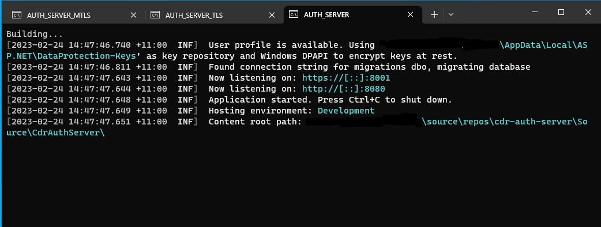
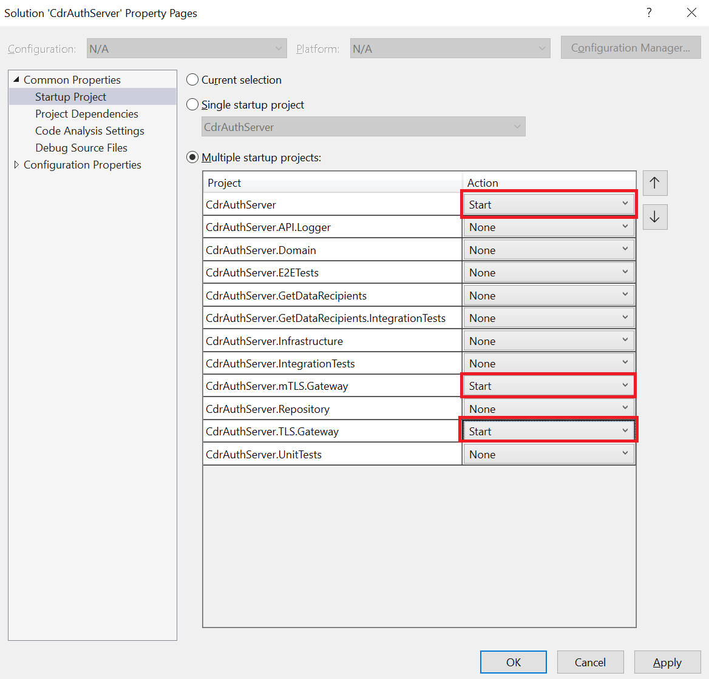
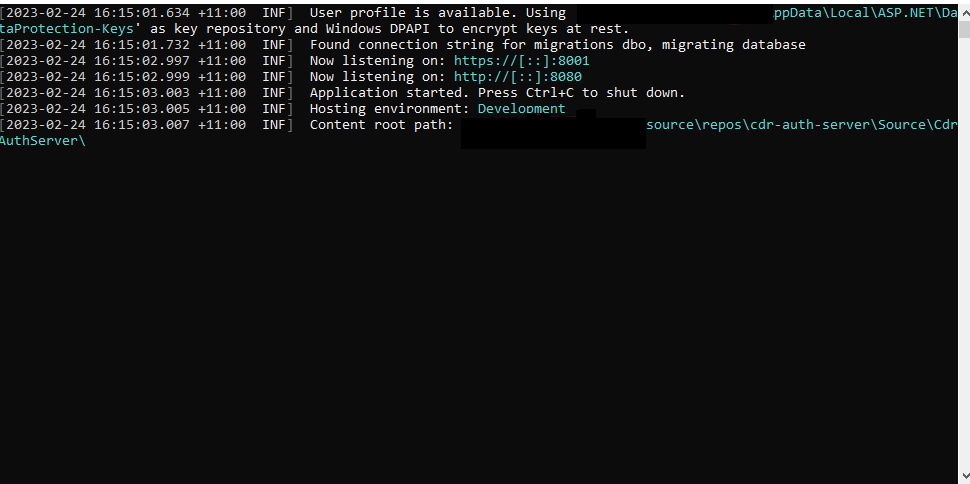
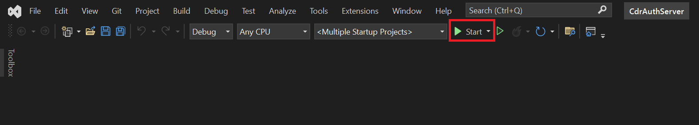

<h2>To get started, clone the source code</h2>

1. Create a folder called CDR 
2. Navigate to this folder 
3. Clone the repo as a subfolder of this folder using the following command; 

git clone https://github.com/ConsumerDataRight/authorisation-server.git 

4. Install the required certificates. See certificate details <a href="../../CertificateManagement/README.md" title="Certificate Management" alt="Certificate Management - CertificateManagement/README.md"> here</a>. 
5. Start the projects in the solution, can be done in multiple ways, examples below are from .Net command line and using MS Visual Studio 

<h2>.Net command line</h2>

1. Download and install the free <a href="https://docs.microsoft.com/en-us/windows/terminal/get-started" title="Download the free Windows Terminal here" alt="Download the free MS Windows Terminal here">MS Windows Terminal</a>
 
2. Use the <a href="../../Source/Start-Auth-Server.bat" title="Use the Start-Auth-Server .Net CLI batch file here" alt="Use the Start-Auth-Server .Net CLI batch file here">Start-Auth-Server</a> batch file to build and run the required projects to start the Mock Data Holder.

 
This will create the LocalDB database by default and seed the database with the supplied sample data.

LocalDB is installed as part of MS Visual Studio. If using MS VSCode, the MS SQL extension will need to be installed.

You can connect to the database from MS Visual Studio using the SQL Explorer, or from MS SQL Server Management Studio (SSMS) using
	the following settings;  
	Server type: Database Engine  
	Server name: (LocalDB)\MSSQLLocalDB  
	Authentication: Windows Authentication 

<h2>MS Visual Studio</h2>

To launch the application using MS Visual Studio, the following projects need to be started:

	CdrAuthServer  
	CdrAuthServer.mTLS.Gateway  
	CdrAuthServer.TLS.Gateway 

1. Navigate to the solution properties and select a "Start" action for the required projects.

 

2. Click "Start" to start the Authorisation Server solution.

 
Output windows will be launched for each of the projects set to start.    
These will show the logging messages as sent to the console in each of the running projects. E.g. 

 
To run the solution in debug mode, simply follow the steps outlined above and click on the "Start" button as shown in the image below:  

