# Test Automation Execution Guide

## Table of Contents
- [Introduction](#introduction)
- [Prerequisites](#prerequisites)
- [Getting Started](#getting-started)
  - [Build or Pull a Mock Register Image](#build-or-pull-a-mock-register-image)
    - [Build a Mock Register image](#build-a-mock-register-image)
    - [Pull and Tag the Latest Image from Docker Hub](#pull-and-tag-the-latest-image-from-docker-hub)
- [Test Execution](#test-execution)
- [Running Tests Using Docker Containers](#running-tests-using-docker-containers)
  - [Running CDR Authorisation Server Integration Tests Using Docker Containers](#running-cdr-authorisation-server-integration-tests-using-docker-containers)
  - [Running CDR Authorisation Server E2E Tests Using Docker Containers](#running-cdr-authorisation-server-e2e-tests-using-docker-containers)
  - [Running Get Data Recipients Integration Tests Using Docker Containers](#running-get-data-recipients-integration-tests-using-docker-containers)
  - [Viewing Test Results](#viewing-test-results)
  - [Running Tests Using Microsoft Visual Studio](#running-tests-using-microsoft-visual-studio)
    - [Setup Local Machine Environment](#setup-local-machine-environment)
    - [Setup Multi-Container Docker Environment](#setup-multi-container-docker-environment)
    - [Running Tests using Microsoft Visual Studio Test Explorer](#running-tests-using-microsoft-visual-studio-test-explorer)
    - [Debugging Tests](#debugging-tests)

# Introduction

This guide provides the necessary information and instructions on setting up an environment to allow for running:
- CDR Authorisation Server integration tests
- CDR Authorisation E2E tests (End-to-end tests that cover user interface testing)
- Get Data Recipient Azure Function integration tests
    
 This guide also provides different options for setting up your environment and running tests by using either Microsoft Visual Studio's Test Explorer or Docker to cater for different use cases.

# Prerequisites  

[Docker Desktop](https://www.docker.com/products/docker-desktop/) is installed and running.

[Microsoft Visual Studio](https://visualstudio.microsoft.com/) is installed.


# Getting Started

Before being able to execute any CDR Authorisation Server automated tests, a Mock Register docker image is required.

This guide explains how a Mock Register docker images can be either built from scratch using the Mock Register GitHub repository, or pulled directly from Docker Hub.

## Build or Pull a Mock Register Image
The Mock Register image can be either built from the GitHub [Mock Register](https://github.com/ConsumerDataRight/mock-register) repository, or pulled directly from [Docker Hub](https://hub.docker.com/r/consumerdataright/mock-register). This guide describes both options and their respective use cases.

### Build a Mock Register image
Building your own Mock Register image may be useful if you want to make changes to any source code in the Mock Register solution. Follow the steps below to build a Mock Register image from scratch:

1. Clone the Mock Register repository using the following command.
```
git clone https://github.com/ConsumerDataRight/mock-register.git
```
2. Run the following command to build the Mock Register docker image from the `mock-register\Source` folder:
```
docker build -f Dockerfile -t mock-register .
```   
The Mock Register docker image should now be available for use in Docker. For further and more detailed documentation regarding the Mock Register, refer to the [Mock Register](https://github.com/ConsumerDataRight/mock-register) GitHub repository.

### Pull and Tag the Latest Image from Docker Hub
Pulling the latest Mock Register image from Docker Hub is a quicker and easier alternative to building your own Mock Register image from scratch. It is recommended for most cases where customisation of the Mock Register code base is not required.

This can be done by simply executing the following docker commands:
```
docker pull consumerdataright/mock-register

docker image tag consumerdataright/mock-register mock-register
```
The Mock Register image should now be available for use in Docker.

# Test Execution
Automated tests can be executed by either using a docker container or by running them directly from Microsoft Visual Studio's Test Explorer. This guide describes both options and their respective use case.

# Running Tests Using Docker Containers
Running tests using a docker container is useful when debugging or stepping through the test's code is not required. 

## Running CDR Authorisation Server Integration Tests Using Docker Containers
The [CDR Authorisation Server Integration Tests Compose File](../../Source/docker-compose.IntegrationTests.Standalone.yml) can be executed using the docker compose command to run the tests within a docker container:

```
docker compose -f "docker-compose.IntegrationTests.Standalone.yml" up -d --build 
```
This docker compose command will start the necessary docker containers and automatically run the CDR Authorisation Server Integration Tests. The following screenshot shows an example of these tests being run:

[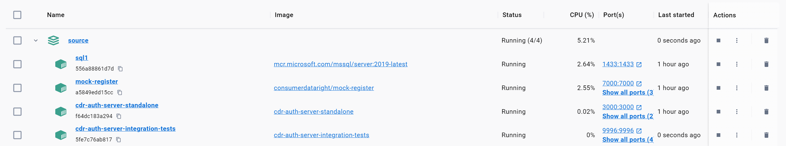](./images/Docker-Compose-Cdr-Auth-Server-Integration-Tests.png)

## Running CDR Authorisation Server E2E Tests Using Docker Containers
The [CDR Authorisation Server E2E Tests Compose File](../../Source/docker-compose.E2ETests.Standalone.yml) can be executed using the docker compose command to run the tests within a docker container::

```
docker compose -f "docker-compose.E2ETests.Standalone.yml" up -d --build 
```
This docker compose command will start the necessary docker containers and automatically run the CDR Authorisation Server E2E Tests. The following screenshot shows an example of these tests being run:

[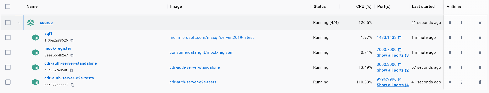](./images/Docker-Compose-Cdr-Auth-Server-E2e-Tests.png)


## Running Get Data Recipients Integration Tests Using Docker Containers
The [Get Data Recipients Integration Tests Compose File](../../Source/docker-compose.GetDataRecipients.IntegrationTests.yml) can be executed using the docker compose command to run the tests within a docker container::

```
docker compose -f "docker-compose.GetDataRecipients.IntegrationTests.yml" up -d --build 
```
This docker compose command will start the necessary docker containers and automatically run the Get Data Recipients integration tests. The following screenshot shows an example of these tests being run:

[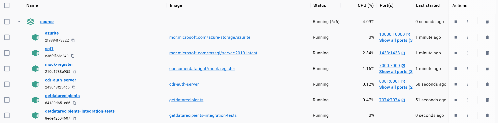](./images/Docker-Compose-Get-Data-Recipients-Running-Tests.png)


**Note:**  The above composed multi-containers must be run independently and cannot co-exist. For example, in order to switch from running E2E tests to running Get Data Recipients integration tests, the E2E Tests multi-container must be deleted before running the compose command for Get Data Recipients integration tests.

## Viewing Test Results

Following the execution of tests using Docker, a folder named '_temp' will be generated in the 'cdr-auth-server/Source' folder. This will contain test results in TRX format and any other artifacts created by the test automation execution. The TRX test results file can be opened and viewed in Microsoft Visual Studio as per example screenshot below:

[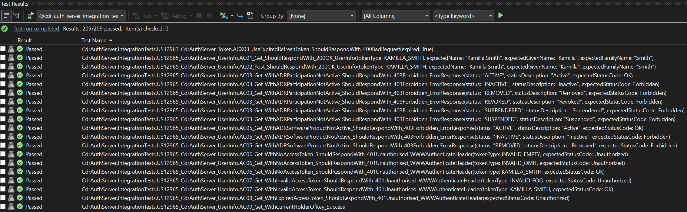](./images/MS-Visual-Studio-View-Test-Results.png)

## Running Tests Using Microsoft Visual Studio
Running tests using Microsoft Visual Studio is required when wanting to debug or step through the test's source code.

### Setup Local Machine Environment

The following host names must be registered in the local machine's `hosts` file (located in C:\Windows\System32\drivers\etc).

```
127.0.0.1   mock-register
127.0.0.1   cdr-auth-server
127.0.0.1   cdr-auth-server-integration-tests
127.0.0.1   cdr-auth-server-e2e-tests
127.0.0.1   cdr-auth-server-standalone
127.0.0.1   getdatarecipients
127.0.0.1   mssql
```

A Windows Environment variable for `ASPNETCORE_ENVIRONMENT` is required to be added and set to `Release`.

The [Mock CDR CA Certificate](../../CertificateManagement/mtls/ca.pfx) is required to be installed in the local machine's Trusted Root Certification Authorities store. 
Consult the [Certificate Management](https://github.com/ConsumerDataRight/mock-register/blob/main/CertificateManagement/README.md) documentation for more information about how certificates are used in CDR Mock Solutions.


### Setup Multi-Container Docker Environment

Before being able to run tests using Microsoft Visual Studio, the required docker containers need to be running in a multi-container docker environment. The following docker compose commands will run the necessary containers:

To setup a multi-container docker environment for **CDR Authorisation Server Integration Tests**, execute the following docker compose command from the `cdr-auth-server\Source` folder:

```
docker compose  -f "docker-compose.IntegrationTests.Standalone.yml" up -d --build mssql mock-register cdr-auth-server 
```


To setup a multi-container docker environment for **CDR Authorisation Server E2E Tests**, execute the following docker compose command from the `cdr-auth-server\Source` folder:
```
docker compose  -f "docker-compose.E2ETests.Standalone.yml" up -d --build mssql mock-register cdr-auth-server 
```


To setup a multi-container docker environment for **Get Data Recipients Integration Tests**, execute the following docker compose command from the `cdr-auth-server\Source` folder:
```
docker compose  -f "docker-compose.GetDataRecipients.IntegrationTests.yml" up -d --build azurite mssql mock-register cdr-auth-server getdatarecipients
```

The following screenshot shows an example of the Get Data Recipients multi-container environment running in Docker:

[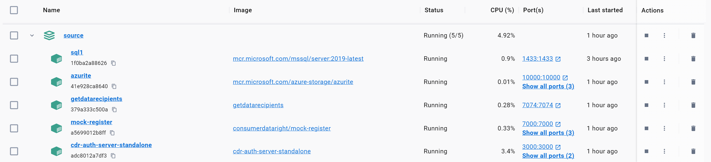](./images/Docker-Compose-Get-Data-Recipients-Ready-For-VS.png)

Tests can now be run using Microsoft Visual Studio.

### Running Tests using Microsoft Visual Studio Test Explorer

The following steps detail the process of running tests using Microsoft Visual Studio's Test Explorer:

1. Open the [CdrAuthServer.sln](../../Source/CdrAuthServer.sln) solution file in Microsoft Visual Studio.
2. Build the solution.
3. Open the Test Explorer. If Test Explorer is not visible, choose 'Test' on the Visual Studio menu and then choose 'Test Explorer'.
   
   [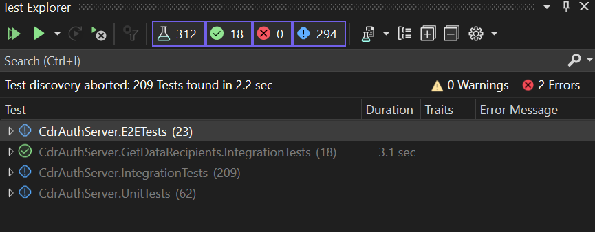](./images/MS-Visual-Studio-Test-Explorer.png)
4. Right click the test, or group of tests to execute and select 'Run' as per screenshot below:
   
   [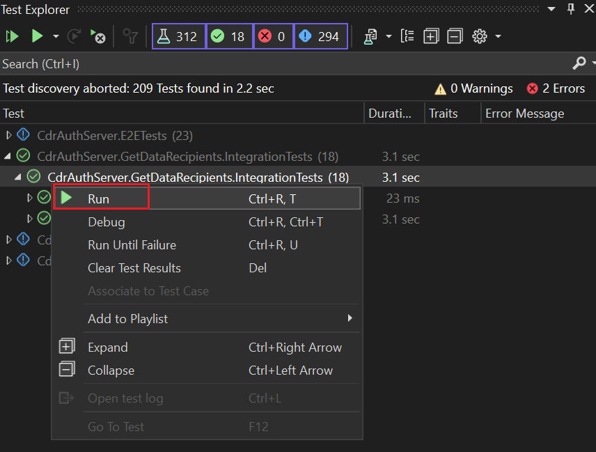](./images/MS-Visual-Studio-Test-Explorer-Run.png)

   The screenshot below is an example of successfully completed Get Data Recipient integration tests:

      [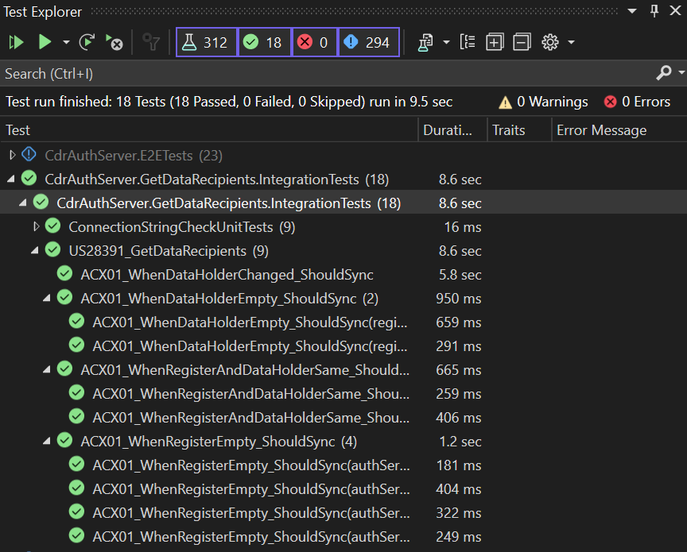](./images/MS-Visual-Studio-Test-Explorer-Execution-Completed.png)

### Debugging Tests

The Test Automation projects use the [ConsumerDataRight.ParticipantTooling.MockSolution.TestAutomation](https://www.nuget.org/packages/ConsumerDataRight.ParticipantTooling.MockSolution.TestAutomation) NuGet package. The source code for this repository is available in the [Mock Solution Test Automation](https://github.com/ConsumerDataRight/mock-solution-test-automation) repository. Cloning this repository to your local machine will allow you to easily debug, step through or even modify any code that was used to build the NuGet package.

This repository can be cloned using following command:
```
git clone https://github.com/ConsumerDataRight/mock-solution-test-automation.git
```

The [CdrAuthServer_Shared.sln](../../Source/CdrAuthServer_Shared.sln) solution has been created to allow for debugging and stepping through the source code used in Mock Solution Test Automation project. 

   [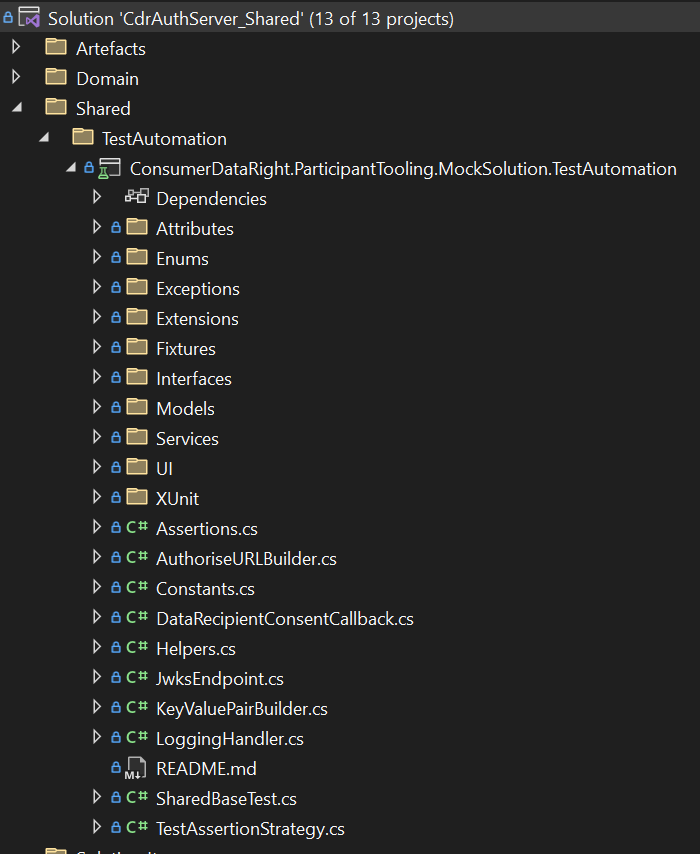](./images/MS-Visual-Studio-View-Cdr-Auth-Server-Shared-Solution.png)

Select the `Shared` solution configuration in Visual Studio to switch from using the Mock Solution Test Automation NuGet package to the using the `ConsumerDataRight.ParticipantTooling.MockSolution.TestAutomation` project instead:

   [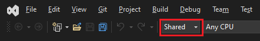](./images/MS-Visual-Studio-View-Cdr-Auth-Server-Shared-Configuration.png)


This will allow for debugging, stepping through and modifying the source code that is used to create the NuGet package. Right click the test, or group of tests you'd like to debug and select 'Debug' to begin debugging tests.

   [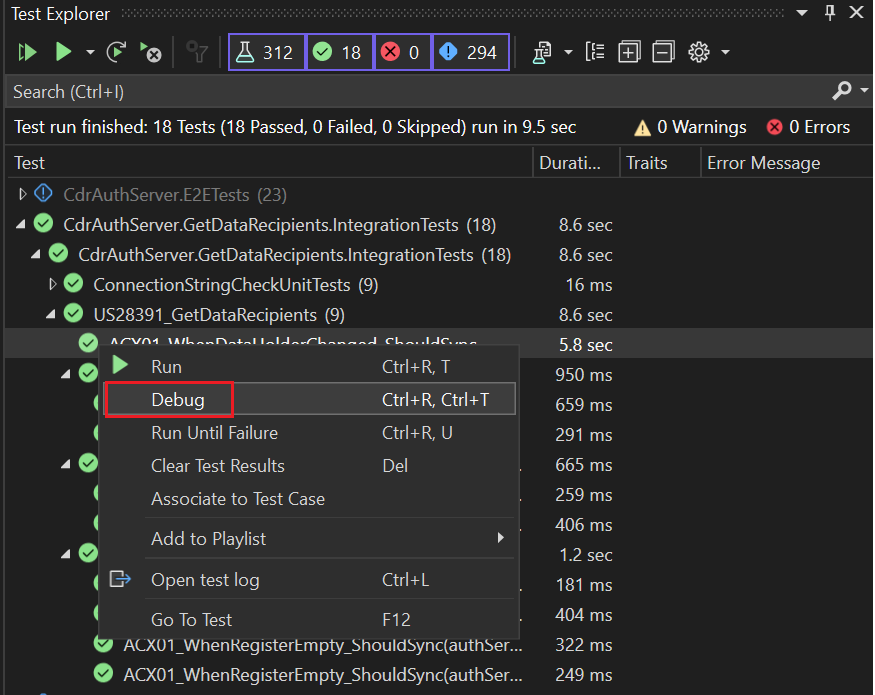](./images/MS-Visual-Studio-Test-Explorer-Debug.png)

For more information on using Microsoft Test Explorer, search for 'Test Explorer' at [Microsoft Learn](https://learn.microsoft.com/).