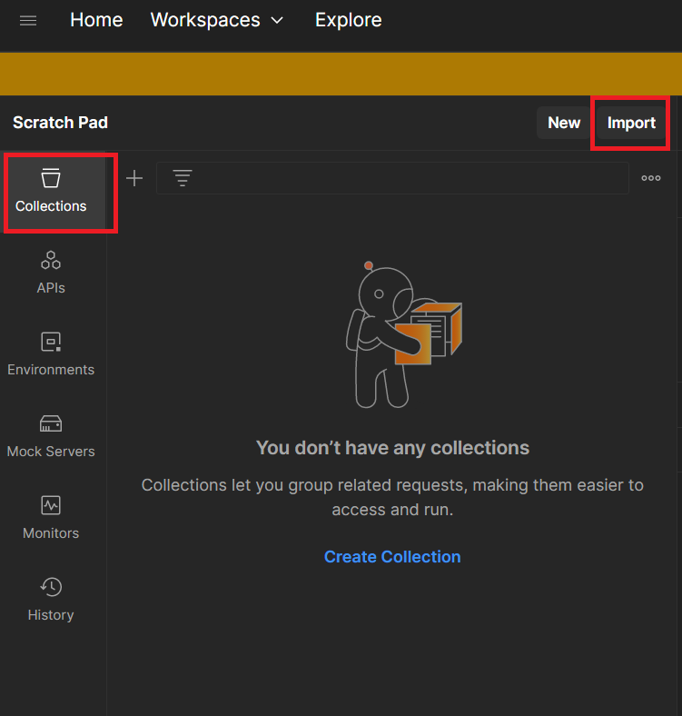
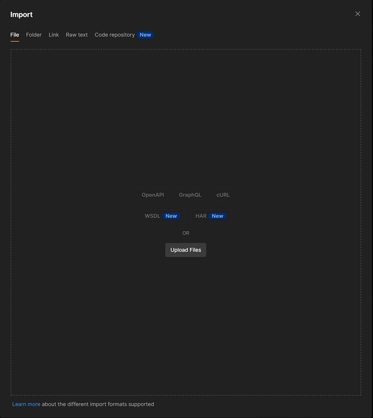
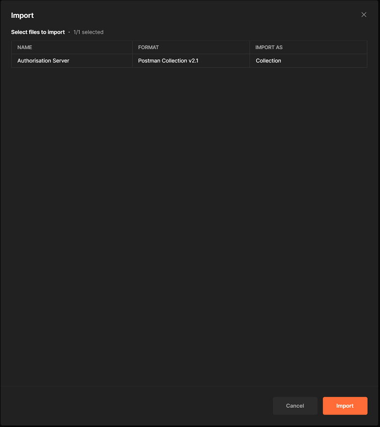
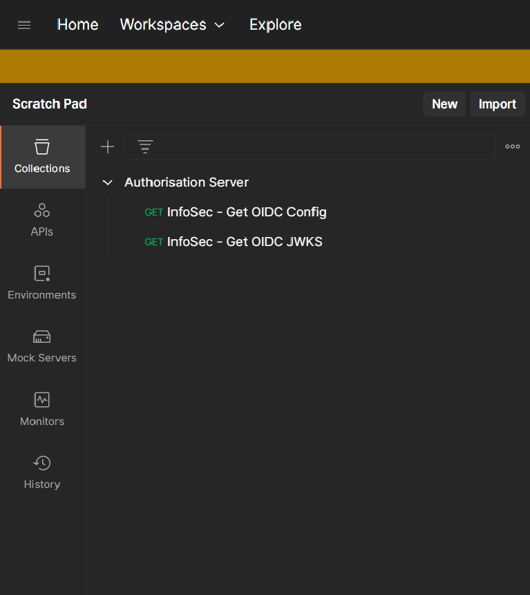

# Postman

A collection of [Postman](https://www.postman.com/) requests have been included to demonstrate the functionality of the Authorisation Server.

In order to use the **Postman** requests:

1. Go to [https://www.postman.com/downloads/](https://www.postman.com/downloads/) to download and install the Postman app.
2. Once installed, open the Postman app.
3. In the `Collections` section, click on the `Import` button.

4. Ensure that the [authorisation-server.postman_collection.json](authorisation-server.postman_collection.json) file has been downloaded to the local device (`git clone` or downloaded).
5. Browse for the [authorisation-server.postman_collection.json](authorisation-server.postman_collection.json) file from the `Files` tab.

6. Click on the `Import` button.

7. The `Mock Data Holder` collection should now be available in the Postman app.

